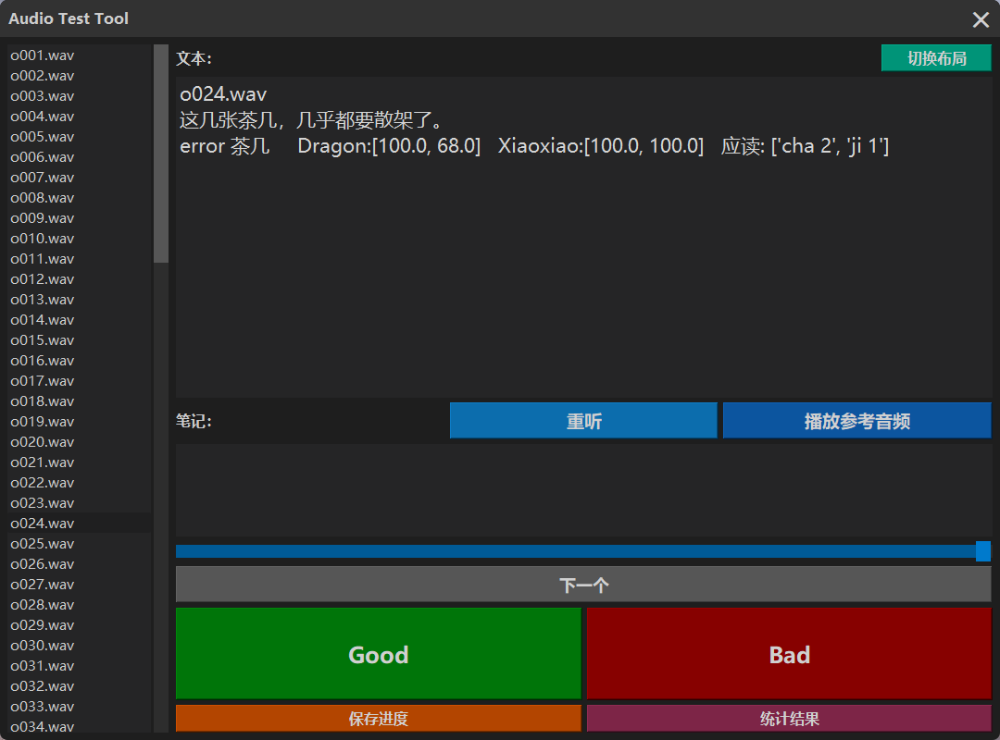

# Audio Evaluation Tool

## Overview

This is an audio evaluation tool, aims for fast audio listening, commenting and evaluation.

## Features

- **Convenient audio playback in folders**
- **Easy comment on audios**
- **Statistic summary provided**

## Usage

### Audio evaluation tool

1. You can use `evaluation_tool.py` to evaluate any audio (only .wav for now) with reference texts folder-wise.
2. After setting the correct path for input folder and txt file(reference folder is optional), the evaluation tool's window shows as below. The default 2 button layout (good & bad) is for general audio evaluation use, alternative 4 button layout (TP - True Positive, TN - True Negative, FP - False Positive, FN - False Negative) is for evaluating more complicated system's recall & accuracy.
3. Click *保存进度* button if you want to continue later, it will save evaluated results in txt and excel. Or click *统计结果* button if you finished the evaluation, the program will save progress and append summary at the end of the txt file, and add a sheet in the excel.

***Warning: Do not close the window before you have clicked one of the buttons, or you will lose all your progress!***

&nbsp;

## Dependencies

- sys
- PyQt5
- simpleaudio
- pydub
